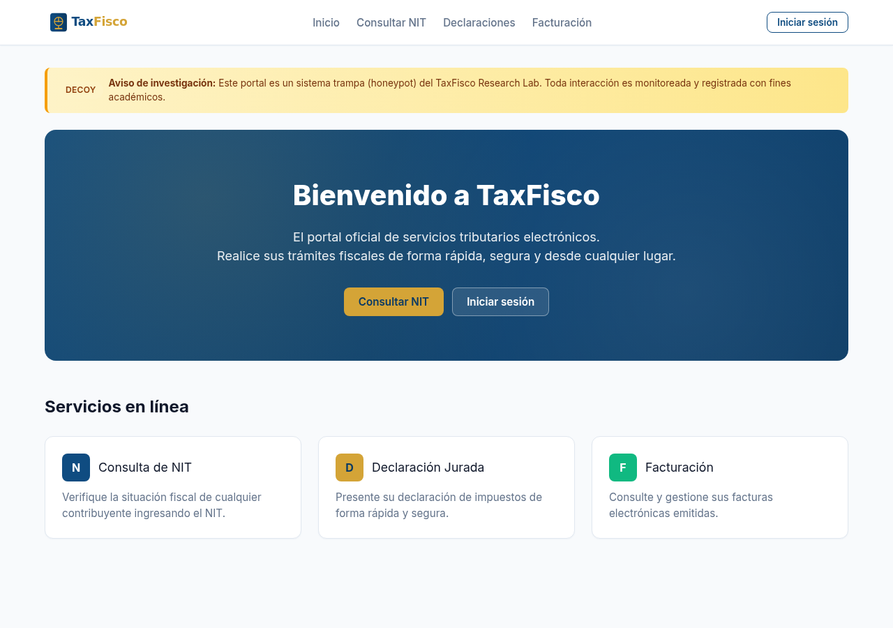
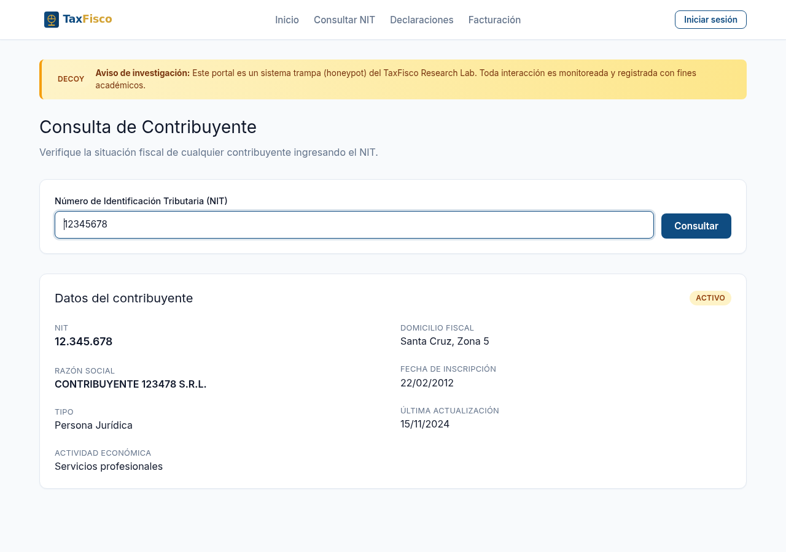
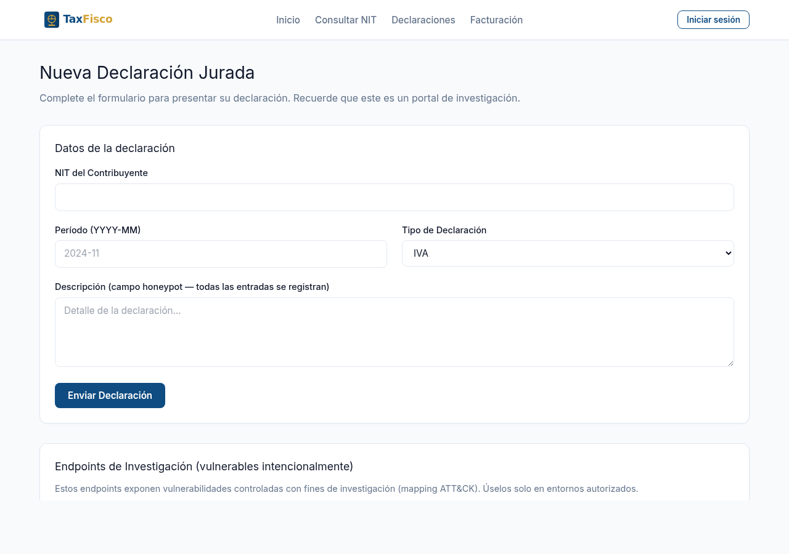
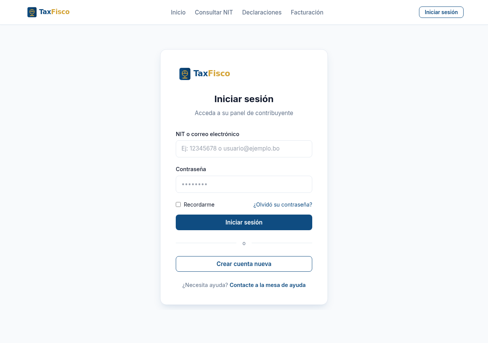
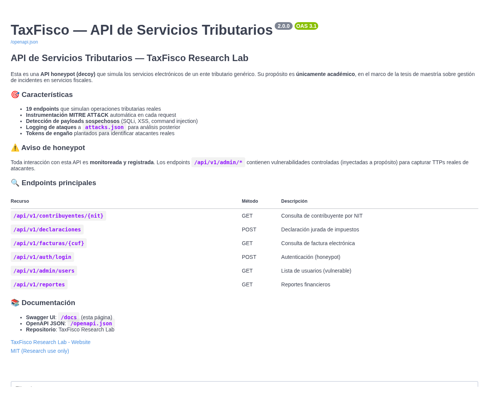

# SIN Research Lab

> **Laboratorio experimental de honeypots y plataforma SOC open source**
> para la tesis de maestría: *"Metodología Honeypot para la Gestión de
> Incidentes en Servicios Fiscales conforme a Normas Internacionales"*

[](LICENSE)
[]()
[]()
[]()
[]()
[]()

## 📋 Descripción

Plataforma integrada de **Detección, Engaño, Monitoreo y Respuesta a Incidentes** que simula un ente tributario genérico ("SIN Research Lab"). Implementa una arquitectura SOC completa open source con honeypots, SIEM, SOAR, Threat Intelligence y DFIR.

## 🎯 Características principales

- **23 servicios Docker** orquestados con Docker Compose
- **4 honeypots multi-protocolo** (Cowrie, Dionaea, OpenCanary, Heralding)
- **2 decoys propios** con instrumentación MITRE ATT&CK (FastAPI + Django)
- **10 escenarios de ataque** documentados y reproducibles
- **Mapeo a estándares**: ISO 27001, ISO 27035, NIST SP 800-61 Rev.3, NIST CSF 2.0, MITRE ATT&CK
- **Optimizado para 16 GB de RAM** + 8 GB de swap
- **100% open source**, reproducible en menos de 30 minutos

## 📸 Visual Tour

Los decoys del lab están diseñados con look moderno **fintech/govtech**
para que las capturas de pantalla y la documentación se vean profesionales.
A continuación, las principales pantallas:

### Portal de contribuyente (Django)

| Landing | Login | Consulta de NIT |
|---|---|---|
|  |  |  |

| Declaración Jurada | Dashboard (requiere login) |
|---|---|
|  |  |

### API REST (FastAPI con Swagger UI)



Swagger UI con tema SIN (paleta azul corporativo + dorado acento),
19 endpoints documentados, 7 grupos (contribuyentes, declaraciones, facturas,
auth, admin, reportes, health) y branding "SIN" en el header.

### Características del branding

- **Paleta**: azul `#0F4C81` (corporativo) + dorado `#D4A437` (acento)
- **Tipografía**: Inter via Google Fonts
- **Logo**: SVG inline (balanza fiscal estilizada)
- **Framework CSS**: Tailwind v3 via CDN
- **Idioma**: Español (es-bo)
- **Templates**: 8 páginas Django (base, home, login, register, dashboard, consulta-ni, facturacion, errores)

## 🏗️ Stack

| Capa | Tecnología |
|---|---|
| SIEM | Wazuh 4.9 (Manager + Indexer + Dashboard) |
| IDS/NDR | Suricata 7.0 + Zeek 6.0 |
| Honeypots | Cowrie, Dionaea, OpenCanary, Heralding |
| Decoys propios | Decoy API (FastAPI) + Decoy Portal (Django) |
| Case Management | TheHive 5.5 + Cortex 3.4 |
| SOAR | Shuffle 1.4+ |
| Threat Intel | MISP 2.4 |
| DFIR | Velociraptor 0.7 |
| Dashboards | Wazuh Dashboard + Grafana 11 |
| DB | PostgreSQL 15 |
| Atacante | Kali Linux (contenedor CLI) |

## 🚀 Inicio rápido

### Requisitos

- Linux Ubuntu 24.04 LTS o Debian 12
- Docker 26+ y Docker Compose v2
- 16 GB de RAM mínimo
- 50 GB de espacio en disco
- 8 GB de swap (se crea automáticamente)

### Instalación

```bash
# 1. Clonar el repositorio
git clone https://github.com/codefher/sin-research-lab.git
cd sin-research-lab

# 2. Configurar entorno
cp .env.example .env
nano .env  # cambiar todas las contraseñas

# 3. Levantar el laboratorio
make lite-up

# 4. Esperar 3-5 minutos

# 5. Acceder a los dashboards
# https://localhost:443       Wazuh
# http://localhost:8443       MISP
# http://localhost:9000       TheHive
# http://localhost:3001       Shuffle
# http://localhost:3000       Grafana
# http://localhost:8080       Decoy API (FastAPI)
# http://localhost:8888       Decoy Portal (Django)
```

### Ejecutar escenarios de ataque

```bash
# Ejecutar los 10 escenarios secuencialmente
make attacks

# Ejecutar un escenario individual
make S04    # SQL Injection
make S08    # Malware drop
make S10    # DNS exfiltration

# Generar análisis de KPIs
make analysis
```

## 📊 Cobertura

- **10/14 tácticas** MITRE ATT&CK cubiertas (71.4%)
- **17 técnicas ATT&CK** detectables
- **5/5 fases** ISO 27035 demostradas (100%)
- **7/7 controles** ISO 27001 relevantes cubiertos (100%)

## 🎓 Contribución original de la tesis

1. **Decoy API Tributaria** (FastAPI) — API REST que simula un ente tributario con instrumentación automática de TTPs MITRE ATT&CK (T1190, T1059, T1083, T1078, T1110.004, T1530, etc.)
2. **Decoy Portal Tributario** (Django) — Portal web con vulnerabilidades controladas y documentadas (SQLi, XSS, LFI, Priv Esc, Data Export, Cmd Injection)
3. **Mapeo cuantitativo ATT&CK ↔ ISO 27035** — Datos empíricos del laboratorio con análisis de MTTD, MTTR, MTTC y MTTContain

## 📚 Documentación

| Documento | Descripción |
|---|---|
| [PERFIL-LITE-16GB.md](PERFIL-LITE-16GB.md) | Guía operativa del perfil de 16 GB |
| [docs/arquitectura.md](docs/arquitectura.md) | Arquitectura detallada |
| [docs/mapeo-iso27035.md](docs/mapeo-iso27035.md) | Mapeo ATT&CK ↔ ISO 27035 |
| [docs/mapeo-iso27001.md](docs/mapeo-iso27001.md) | Mapeo a controles ISO 27001 |
| [docs/decisiones-ram-16gb.md](docs/decisiones-ram-16gb.md) | Decisiones arquitectónicas para 16 GB |
| [docs/threat-model.md](docs/threat-model.md) | Modelo de amenaza |
| [docs/decision-log.md](docs/decision-log.md) | Log de decisiones (ADR) |
| [docs/limitaciones.md](docs/limitaciones.md) | Limitaciones reconocidas |
| [docs/quick-start.md](docs/quick-start.md) | Inicio rápido |

## 🔐 Credenciales y setup post-instalación

Después de `make lite-up`, ejecuta **una sola vez**:

```bash
bash scripts/setup-credentials.sh
```

Esto crea automáticamente:
- Superuser Django (`admin` / `admin`) para el Decoy Portal
- Usuario MISP (`admin@admin.test` / `admin`) + API key
- Verifica/reset de Grafana
- Pre-crea índices `thehive` y `thehive_global` en Wazuh Indexer
- Reaplica config del Wazuh Dashboard

El script es **idempotente** (se puede correr varias veces sin fallar). Tarda ~30 segundos.

**Tabla completa de credenciales** (Wazuh, TheHive, MISP, Grafana, decoys, etc.) en [`docs/credentials.md`](./docs/credentials.md).

## 🔧 Comandos útiles (Makefile)

```bash
make lite-up        # Levantar el lab + crear swap + configurar TheHive
make lite-down      # Detener el lab
make lite-status    # Ver uso de RAM y estado
make lite-clean     # Limpiar todo (incluye datos)
make attacks        # Ejecutar los 10 escenarios
make analysis       # Generar análisis de KPIs
make S04            # Escenario individual (S01-S10)
make attacker       # Acceder al contenedor atacante
make dashboards     # Ver URLs de todos los dashboards
make backup         # Backup de datos
make logs           # Ver logs en tiempo real
make stats          # Uso de recursos (CPU/RAM)
```

## 🏛️ Estructura del proyecto

```
sin-research-lab/
├── docker-compose.yml          # Orquestador maestro
├── .env.example                # Variables de entorno (plantilla)
├── Makefile                    # Comandos simplificados
├── README.md                   # Este archivo
├── PERFIL-LITE-16GB.md         # Guía operativa
├── LICENSE                     # Licencia MIT
├── .gitignore                  # Exclusiones de Git
├── .github/
│   └── workflows/lint.yml      # GitHub Actions
├── config/                     # Configuraciones de cada servicio
│   ├── wazuh/                  # Reglas + decoders ATT&CK
│   ├── suricata/               # Reglas de NIDS
│   ├── zeek/                   # Scripts de NDR
│   ├── thehive/                # Config de TheHive
│   ├── cortex/                 # Config de Cortex
│   ├── shuffle/                # Workflows SOAR
│   ├── misp/                   # Plantilla de config
│   ├── velociraptor/           # Config del DFIR
│   ├── cowrie/                 # Honeypot SSH
│   ├── dionaea/                # Honeypot malware
│   ├── opencanary/             # Honeypot multi-protocolo
│   ├── heralding/              # Honeypot credenciales
│   └── grafana/                # Dashboards JSON
├── decoys/                     # Contribución original de la tesis
│   ├── api-tributaria/         # FastAPI con ATT&CK instrumentation
│   │   ├── main.py
│   │   ├── endpoints/          # Rutas REST
│   │   ├── instrumentation/    # Detector de TTPs
│   │   └── data/               # Datos sintéticos
│   └── portal-tributario/      # Django con vulns controladas
│       ├── portal/
│       └── templates/
├── attack-scenarios/           # 10 escenarios de ataque
│   ├── S01-reconocimiento/
│   ├── S02-escaneo-web/
│   ├── S03-bruteforce-ssh/
│   ├── S04-sql-injection/
│   ├── S05-credential-stuffing/
│   ├── S06-xss/
│   ├── S07-api-abuse/
│   ├── S08-malware-drop/
│   ├── S09-reverse-shell/
│   ├── S10-exfiltracion-dns/
│   └── run_all.sh              # Ejecuta los 10 secuencialmente
├── analysis/                   # Scripts de análisis
│   ├── kpi_calculator.py       # MTTD, MTTR, MTTC
│   ├── mitre_coverage.py       # Matriz ATT&CK
│   └── iso27035_mapping.py     # Mapeo normativo
├── scripts/                    # Utilidades
│   ├── setup-swap-8gb.sh       # Crear swap
│   └── setup-wazuh-index-for-thehive.sh
├── docs/                       # Documentación
└── tesis/                      # Borradores de capítulos
```

## 🧬 Estrategia de versionado (Prototipos I y II)

Este repositorio contiene **dos prototipos** de la tesis, developed sobre el mismo
historial de Git. La carpeta local se llama `tesis-honeypot-lab` (nombre neutro) pero
**el remoto y la URL de Git no cambian** respecto al Prototipo I.

### Ramas

| Rama | Contenido | Estado |
|---|---|---|
| `main` | Tronco. Estado aprobado del Prototipo I. | Congelada |
| `prototipo-1-entidad-homologada` | Copia congelada del P1 aprobado por la tutora. | Congelada |
| `prototipo-2-sin` | **Rama de trabajo del Prototipo II** (contexto SIN Bolivia). | Activa |

### Tags

| Tag | Significado |
|---|---|
| `v1.0-prototipo-1` | Estado aprobado del Prototipo I (entidad homologada). |
| `v2.0-it1` | Prototipo II v1.0, listo para ejecutar (iteración 1). |
| `v2.1-it2` | Prototipo II con mejoras de la iteración 2. |

### Reconstruir el Prototipo I

El Prototipo I se reconstruye **exactamente** desde `main` + el tag `v1.0-prototipo-1`:

```bash
git checkout v1.0-prototipo-1      # congela el P1
# o
git checkout prototipo-1-entidad-homologada
```

No se reescribe el historial en ninguna circunstancia: no hay rebase, no hay force-push,
no se borran commits ni tags.

### Convención de commits

En el Prototipo II todos los commits llevan el prefijo `[P2]`, por ejemplo:

```
[P2] clean: carpeta evidencias vacia para nuevo prototipo
[P2] infra: artefactos docker renombrados a prefijo sin
[P2] rebrand: portal SIN, login estilo OIDC
```

### Levantar ambos prototipos a la vez (opcional)

Los dos labs renombran sus artefactos Docker para poder coexistir sin colisiones:

| Artefacto | Prototipo I | Prototipo II |
|---|---|---|
| `name:` (proyecto compose) | `sin-research-lab-lite` | `sin-research-lab` |
| Redes | `sin-dmz`, `sin-honeypot`, `sin-ids`, `sin-soc` | `sin-dmz`, `sin-honeypot`, `sin-ids`, `sin-soc` |
| Volúmenes | `sin-research-lab-lite_*` | `sin-research-lab_*` |
| Imágenes propias | `sin/decoy-portal`, `sin/decoy-api` | `sin/decoy-portal`, `sin/decoy-api` |
| Contenedores | `sin-*` | `sin-*` |

Los puertos del host usan un **offset `+10000`** en el P2 para que no choquen si ambos
corren simultáneamente. Por ejemplo: Grafana `3000` → `13000`, API `8090` → `18090`,
Portal `8890` → `18890`, Wazuh Dashboard `1443` → `11443`, MISP `8443` → `18443`.
El detalle completo de puertos está en `docs/`.

## 🎓 Tesis

**Título**: Metodología Honeypot para la Gestión de Incidentes en Servicios Fiscales conforme a Normas Internacionales

**Programa**: Maestría en Seguridad Informática

**Año**: 2024-2026

## 📄 Licencia

MIT — Ver [LICENSE](LICENSE)

## ⚠️ Aviso ético

Este laboratorio contiene herramientas de seguridad ofensiva (nmap, sqlmap, hydra, etc.) que solo deben usarse en entornos controlados y con fines de investigación. **NO usar contra sistemas sin autorización explícita**.

## 🤝 Contribuciones

Este es un repositorio de tesis académica. Las mejoras, extensiones y reportes de issues son bienvenidos vía Pull Request.

## 📧 Contacto

- GitHub: [@codefher](https://github.com/codefher)
- Issues: [GitHub Issues](https://github.com/codefher/sin-research-lab/issues)

## ⭐ Si este proyecto te fue útil, considera darle una estrella

Ayuda a que más investigadores encuentren este trabajo.
